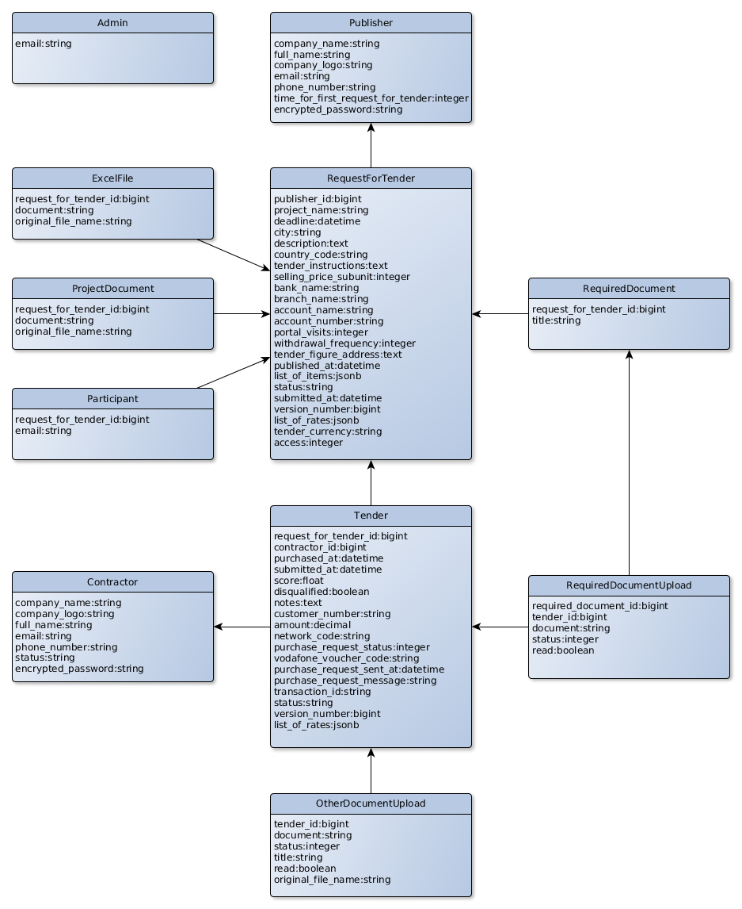

# TenderSwift

[](https://www.codacy.com?utm_source=github.com&amp;utm_medium=referral&amp;utm_content=peter-ohara/tenderswift&amp;utm_campaign=Badge_Grade)
[](https://www.codacy.com?utm_source=github.com&utm_medium=referral&utm_content=peter-ohara/tenderswift&utm_campaign=Badge_Coverage)

A web application for construction companies, which allows them to 
automatically evaluate tenders, thus saving them hours of work and eliminating 
errors that routinely cost them thousands of dollars per project.

## Architecture and models




## Development

##### Prerequisites

The setups steps expect following tools installed on the system.

- Git
- Ruby [2.4.2](https://github.com/peter-ohara/tenderswift/blob/master/.ruby-version#L1)
- Rails [5.1.2](https://github.com/peter-ohara/tenderswift/blob/master/Gemfile#L12)

##### 1. Check out the repository

```bash
git clone git@github.com:peter-ohara/tenderswift.git
```

##### 2. Create database.yml file

Copy the sample database.yml file and edit the database configuration as required.

```bash
cp config/database.yml.sample config/database.yml
```

##### 3. Create and setup the database

Run the following commands to create and setup the database.

```ruby
bundle exec rake db:create
bundle exec rake db:setup
```

##### 4. Start the Rails server

You can start the rails server using the command given below.

```ruby
bundle exec rails s
```

And now you can visit the site with the URL http://localhost:3000